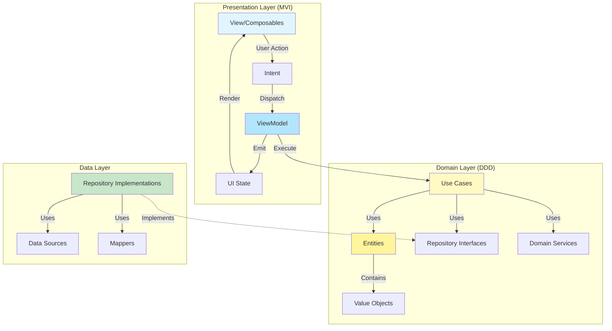

# Architecture

このドキュメントでは、本プロジェクトのアーキテクチャ設計について説明します。

## 目次

- [概要](#概要)
- [アーキテクチャ図](#アーキテクチャ図)
- [レイヤー構成](#レイヤー構成)
  - [1. Presentation Layer (MVI Pattern)](#1-presentation-layer-mvi-pattern)
  - [2. Domain Layer (DDD)](#2-domain-layer-ddd)
  - [3. Data Layer](#3-data-layer)
- [依存関係ルール](#依存関係ルール)
- [データフロー](#データフロー)
- [モジュール分割戦略](#モジュール分割戦略)
- [プラットフォーム戦略](#プラットフォーム戦略)
- [テスト戦略](#テスト戦略)
- [ベストプラクティス](#ベストプラクティス)

## 概要

本プロジェクトは **DDD + Clean Architecture + Hexagonal Architecture** を組み合わせて採用し、以下の特徴を持ちます：

- **Presentation層**: MVI (Model-View-Intent) パターン
- **Domain層**: DDD (Domain-Driven Design) のプラクティス
- **依存方向**: Clean Architecture に従い、内側（Domain）へ依存
- **Data層**: Hexagonal Architecture の Adapter として外部依存を隔離
- **モジュール分割**: 水平分割（レイヤーごと）のみ、垂直分割（機能別）は行わない

## アーキテクチャ図



## レイヤー構成

### 採用しているアーキテクチャ要素

| アーキテクチャ | 採用している要素 | 適用箇所 |
|---------------|------------------|---------|
| **DDD** | エンティティ/値オブジェクト/ドメインサービス/Repositoryインターフェース | `domain/` 全体 |
| **Clean Architecture** | 依存方向のルール（内側へ依存）/UseCase中心 | `presentation/` → `domain/`、`data/` → `domain/` |
| **Hexagonal Architecture** | Port = Repository、Adapter = Data実装 | `domain/repository` と `data` 実装群 |

### 1. Presentation Layer (MVI Pattern)

**責務**: ユーザーインターフェースとユーザーインタラクションの管理

**パターン**: Model-View-Intent (MVI)

**モジュール構造**:
```
presentation/
├── common/                    # 共通ユーティリティ、Platform
├── designsystem/              # Design System (Tokens, Theme, Components)
├── navigation/                # ナビゲーション (composeApp からのエントリポイント)
└── feature/                   # 機能別モジュール (画面単位)
    ├── home/                  # ホーム画面
    ├── sort/                  # ソート可視化画面
    ├── learn/                 # 学習画面
    ├── compare/               # 比較画面
    └── settings/              # 設定画面
```

**各モジュールの責務**:

| モジュール | 責務 | 依存先 |
|-----------|------|--------|
| `common` | Platform expect/actual, 共通ユーティリティ | - |
| `designsystem` | ColorTokens, Theme, Atomic Components | - |
| `navigation` | NavHost, 画面遷移ロジック、**全Feature集約** | common, designsystem, 全feature |
| `feature/*` | 各画面のUI, ViewModel, MVI (Intent/State) | common, designsystem, domain |

**依存関係フロー**:
```
composeApp
    └── navigation (Presentation層への唯一のエントリポイント)
            ├── feature/home
            ├── feature/sort
            ├── feature/learn
            ├── feature/compare
            └── feature/settings
                    └── common, designsystem
```

**MVI フロー**:
1. **View** → ユーザーアクションを**Intent**として発行
2. **Intent** → **ViewModel**で処理
3. **ViewModel** → **Use Case**を実行してビジネスロジックを実行
4. **ViewModel** → 結果を**State**に変換
5. **State** → **View**が購読して再レンダリング

**主要コンポーネント**:
- **Intent**: ユーザーアクションを表す密封クラス
- **State**: UI状態を表すデータクラス
- **ViewModel**: IntentからStateへの変換を管理

---

### 2. Domain Layer (DDD)

**責務**: ビジネスロジックとドメインルールの実装

**パターン**: Domain-Driven Design

```
domain/
└── src/
    └── commonMain/kotlin/dotnet/sort/
        ├── usecase/
        │   └── XxxUseCase.kt      # ユースケース
        ├── entity/
        │   └── Xxx.kt             # エンティティ
        ├── valueobject/
        │   └── XxxId.kt           # 値オブジェクト
        ├── repository/
        │   └── XxxRepository.kt   # リポジトリインターフェース
        ├── service/
        │   └── XxxDomainService.kt # ドメインサービス
        └── exception/
            └── XxxException.kt    # ドメイン例外
```

**DDD コンポーネント**:

#### **Use Cases (ユースケース)**
- アプリケーションの具体的な機能を表現
- Presention層からのエントリーポイント
- 単一責任の原則に従う

```kotlin
class GetUserProfileUseCase(
    private val userRepository: UserRepository
) {
    suspend operator fun invoke(userId: UserId): Result<User> {
        return userRepository.findById(userId)
    }
}
```

#### **Entities (エンティティ)**
- 一意の識別子を持つドメインオブジェクト
- ビジネスロジックとルールをカプセル化

```kotlin
data class User(
    val id: UserId,
    val name: UserName,
    val email: Email,
    val createdAt: Instant
) {
    fun updateEmail(newEmail: Email): User {
        // ビジネスルールをここで検証
        return copy(email = newEmail)
    }
}
```

#### **Value Objects (値オブジェクト)**
- 識別子を持たない不変オブジェクト
- 値の妥当性を保証

```kotlin
@JvmInline
value class UserId(val value: String) {
    init {
        require(value.isNotBlank()) { "UserId cannot be blank" }
    }
}
```

#### **Repository Interfaces**
- データ永続化の抽象化
- Data層での実装を定義

```kotlin
interface UserRepository {
    suspend fun findById(id: UserId): Result<User>
    suspend fun save(user: User): Result<Unit>
    suspend fun delete(id: UserId): Result<Unit>
}
```

#### **Domain Services**
- 複数のエンティティにまたがるビジネスロジック
- エンティティに属さないロジック

```kotlin
class UserRegistrationService(
    private val userRepository: UserRepository
) {
    suspend fun register(email: Email, name: UserName): Result<User> {
        // 重複チェックなどの複雑なロジック
    }
}
```

---

### 3. Data Layer

**責務**: データアクセスと外部I/Oの実装

```
data/
└── src/
    ├── commonMain/
    │   └── kotlin/
    │       └── dotnet/sort/
    │           ├── database/   # SQLDelight Provider
    │           ├── generator/
    │           └── repository/
    ├── commonMain/sqldelight/  # SQLDelight schema
    ├── jvmMain/
    ├── jsMain/
    └── wasmJsMain/
```

**Data層の責務**:
- **Database**: SQLDelight による履歴イベントの永続化
- **Generator**: 配列生成アルゴリズム
- **Repository実装**: Domain層のRepositoryインターフェース実装

---


## 依存関係ルール

### Clean Architectureの依存関係の方向

```
Presentation → Domain ← Data
```

- **Presentation** は **Domain** に依存
- **Data** は **Domain** に依存
- **Domain** は他のレイヤーに依存しない（完全に独立）

### モジュール間の依存

```kotlin
// build.gradle.kts (presentation)
dependencies {
    implementation(projects.domain)  // ✅ OK
}

// build.gradle.kts (data)
dependencies {
    implementation(projects.domain)  // ✅ OK
}

// build.gradle.kts (domain)
dependencies {
    // 他のモジュールへの依存なし  // ✅ OK
}
```

---

## データフロー

### 典型的なユーザーアクションのフロー

```
1. User Action (View)
   ↓
2. Intent Dispatched (ViewModel)
   ↓
3. Use Case Execution (Domain)
   ↓
4. Repository Call (Domain Interface)
   ↓
5. Data Source Access (Data Implementation)
   ↓
6. DTO → Entity Mapping (Data)
   ↓
7. Result Return (Back through layers)
   ↓
8. State Update (ViewModel)
   ↓
9. UI Recomposition (View)
```

### コード例

```kotlin
// 1. View - User Action
@Composable
fun UserProfileScreen(viewModel: UserProfileViewModel) {
    val state by viewModel.state.collectAsState()
    
    Button(onClick = { 
        viewModel.handleIntent(UserProfileIntent.LoadProfile("user123"))
    }) {
        Text("Load Profile")
    }
}

// 2. ViewModel - Intent Processing
class UserProfileViewModel(
    private val getUserProfile: GetUserProfileUseCase
) : ViewModel() {
    private val _state = MutableStateFlow(UserProfileState())
    val state: StateFlow<UserProfileState> = _state.asStateFlow()
    
    fun handleIntent(intent: UserProfileIntent) {
        when (intent) {
            is UserProfileIntent.LoadProfile -> loadProfile(intent.userId)
        }
    }
    
    private fun loadProfile(userId: String) {
        viewModelScope.launch {
            _state.value = _state.value.copy(isLoading = true)
            
            getUserProfile(UserId(userId))
                .onSuccess { user ->
                    _state.value = UserProfileState(
                        user = user,
                        isLoading = false
                    )
                }
                .onFailure { error ->
                    _state.value = UserProfileState(
                        error = error.message,
                        isLoading = false
                    )
                }
        }
    }
}

// 3. Use Case - Business Logic
class GetUserProfileUseCase(
    private val userRepository: UserRepository
) {
    suspend operator fun invoke(userId: UserId): Result<User> {
        return userRepository.findById(userId)
    }
}

// 4. Repository Implementation - Data Access
class UserRepositoryImpl(
    private val remoteDataSource: UserRemoteDataSource,
    private val mapper: UserMapper
) : UserRepository {
    override suspend fun findById(id: UserId): Result<User> {
        return remoteDataSource.getUser(id.value)
            .map { dto -> mapper.toDomain(dto) }
    }
}
```

---

## モジュール分割戦略

### 水平分割（Horizontal Slicing）

本プロジェクトは**レイヤーごとにモジュールを分割**します：

```
dotnet/
├── presentation/    # Presentation Layer
├── domain/          # Domain Layer
└── data/            # Data Layer
```

**メリット**:
- レイヤー間の依存関係が明確
- アーキテクチャの境界が強制される
- シンプルな構造で理解しやすい

### 垂直分割は行わない

機能別（Feature別）のモジュール分割は**行いません**：

```
❌ 採用しない構造:
dotnet/
├── feature-user/
├── feature-product/
└── feature-order/
```

**理由**:
- プロジェクトの初期段階では不要な複雑さを避ける
- 機能間の依存関係が複雑になる可能性
- 水平分割で十分な関心の分離が達成できる

---

## プラットフォーム戦略

### Kotlin Multiplatform 構成

全てのレイヤーで以下のプラットフォームをサポート:

- **JVM** (Desktop)
- **JS** (Web - JavaScript)
- **WasmJS** (Web - WebAssembly)

### プラットフォーム固有コード

各レイヤーのソースセット構造:

```
*/src/
├── commonMain/        # 共通コード (すべてのプラットフォーム)
├── jvmMain/           # JVM固有コード
├── jsMain/            # JS固有コード
└── wasmJsMain/        # WasmJS固有コード
```

**原則**:
- 可能な限り`commonMain`にコードを配置
- プラットフォーム固有の実装は最小限に
- `expect/actual`パターンで抽象化

---

## テスト戦略

### レイヤーごとのテスト

```
presentation/
└── src/
    ├── commonTest/    # ViewModelのテスト
    └── ...

domain/
└── src/
    ├── commonTest/    # Use Case、Entity、Value Objectのテスト
    └── ...

data/
└── src/
    ├── commonTest/    # Repository、Data Sourceのテスト
    └── ...
```

### テストの種類

1. **Unit Tests** - 個別のクラス/関数のテスト
2. **Integration Tests** - レイヤー間の統合テスト
3. **UI Tests** - Compose UIのテスト

---

## ベストプラクティス

### 1. 単一責任の原則(SRP)
- 各クラスは1つの責務のみを持つ
- Use Caseは1つの機能のみを実装

### 2. 依存性逆転の原則 (DIP)
- 上位レイヤーは抽象に依存
- Repositoryはinterfaceとして定義

### 3. インターフェース分離の原則 (ISP)
- 必要最小限のメソッドのみを公開
- 大きなinterfaceは分割

### 4. 不変性 (Immutability)
- できる限り`val`を使用
- Data classは不変に保つ
- Stateは常に新しいインスタンスを作成

### 5. Null安全性
- Nullable型は最小限に
- `Result`型でエラーハンドリング


