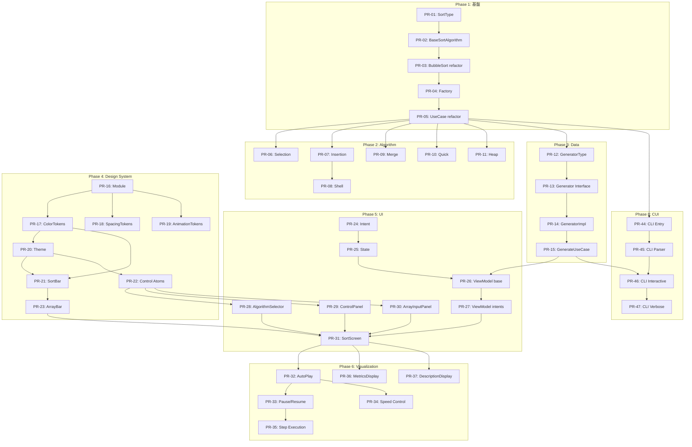

# Development Plan / 開発計画

このドキュメントでは、ソートアルゴリズム教育ツールの開発計画を記述します。各PRは小さな単位に分割し、レビューしやすいコード量を維持します。

## 目次

- [1. 開発方針](#1-開発方針)
- [2. PR一覧（時系列順）](#2-pr一覧時系列順)
- [3. Phase 1: 基盤整備](#3-phase-1-基盤整備)
- [4. Phase 2: アルゴリズム実装](#4-phase-2-アルゴリズム実装)
- [5. Phase 3: Data層実装](#5-phase-3-data層実装)
- [6. Phase 4: Design System構築](#6-phase-4-design-system構築)
- [7. Phase 5: UI実装](#7-phase-5-ui実装)
- [8. Phase 6: 可視化機能](#8-phase-6-可視化機能)
- [9. Phase 7: テスト・品質保証](#9-phase-7-テスト品質保証)
- [10. Phase 8: CUI実装](#10-phase-8-cui実装)
- [11. Phase 9: リリース準備](#11-phase-9-リリース準備)

---

## 1. 開発方針

### 1.1 PR サイズガイドライン

| サイズ | 変更行数 | レビュー時間目安 |
|--------|----------|------------------|
| 🟢 XS | ~50行 | 5分 |
| 🟢 S | ~100行 | 15分 |
| 🟡 M | ~200行 | 30分 |
| 🟠 L | ~400行 | 1時間 |
| 🔴 XL | 400行+ | 避ける |

**目標**: 1PR あたり **100-200行** を目安とする

### 1.2 ブランチ命名規則

```
feature/{PR番号}
```

**例**:
- `feature/01`
- `feature/06`
- `feature/31`

### 1.3 依存関係の表記

```
[PR-XX] → [PR-YY]  # PR-XX が完了後に PR-YY を開始
[PR-XX] ⇄ [PR-YY]  # 並行作業可能
```

---

## 2. PR一覧（時系列順）

### Phase 1: 基盤整備 (5 PRs)

| PR # | タスク | ブランチ | サイズ | 依存 |
|------|--------|----------|--------|------|
| PR-01 | SortType enum 拡張 | `feature/01` | 🟢 XS | - |
| PR-02 | BaseSortAlgorithm 作成 | `feature/02` | 🟡 M | PR-01 |
| PR-03 | BubbleSort リファクタリング | `feature/03` | 🟢 S | PR-02 |
| PR-04 | SortAlgorithmFactory 作成 | `feature/04` | 🟢 S | PR-03 |
| PR-05 | ExecuteSortUseCase リファクタリング | `feature/05` | 🟢 XS | PR-04 |

### Phase 2: アルゴリズム実装 (6 PRs)

| PR # | タスク | ブランチ | サイズ | 依存 |
|------|--------|----------|--------|------|
| PR-06 | SelectionSort 実装 | `feature/06` | 🟢 S | PR-05 |
| PR-07 | InsertionSort 実装 | `feature/07` | 🟢 S | PR-05 |
| PR-08 | ShellSort 実装 | `feature/08` | 🟡 M | PR-07 |
| PR-09 | MergeSort 実装 | `feature/09` | 🟡 M | PR-05 |
| PR-10 | QuickSort 実装 | `feature/10` | 🟡 M | PR-05 |
| PR-11 | HeapSort 実装 | `feature/11` | 🟡 M | PR-05 |

### Phase 3: Data層実装 (4 PRs)

| PR # | タスク | ブランチ | サイズ | 依存 |
|------|--------|----------|--------|------|
| PR-12 | ArrayGeneratorType enum | `feature/12` | 🟢 XS | PR-05 |
| PR-13 | ArrayGenerator interface | `feature/13` | 🟢 XS | PR-12 |
| PR-14 | ArrayGeneratorImpl 実装 | `feature/14` | 🟢 S | PR-13 |
| PR-15 | GenerateArrayUseCase | `feature/15` | 🟢 S | PR-14 |

### Phase 4: Design System構築 (8 PRs)

| PR # | タスク | ブランチ | サイズ | 依存 |
|------|--------|----------|--------|------|
| PR-16 | designsystem モジュール作成 | `feature/16` | 🟢 XS | - |
| PR-17 | ColorTokens 定義 | `feature/17` | 🟢 XS | PR-16 |
| PR-18 | SpacingTokens 定義 | `feature/18` | 🟢 XS | PR-16 |
| PR-19 | AnimationTokens 定義 | `feature/19` | 🟢 XS | PR-16 |
| PR-20 | Theme/Color/Typography | `feature/20` | 🟢 S | PR-17 |
| PR-21 | SortBar Atom | `feature/21` | 🟢 S | PR-17, PR-20 |
| PR-22 | SortButton/SortSlider Atoms | `feature/22` | 🟢 S | PR-20 |
| PR-23 | ArrayBar Molecule | `feature/23` | 🟢 S | PR-21 |

### Phase 5: UI実装 (8 PRs)

| PR # | タスク | ブランチ | サイズ | 依存 |
|------|--------|----------|--------|------|
| PR-24 | SortIntent 定義 | `feature/24` | 🟢 XS | - |
| PR-25 | SortState 定義 | `feature/25` | 🟢 S | PR-24 |
| PR-26 | SortViewModel 基本構造 | `feature/26` | 🟡 M | PR-25, PR-15 |
| PR-27 | SortViewModel Intent処理 | `feature/27` | 🟡 M | PR-26 |
| PR-28 | AlgorithmSelector コンポーネント | `feature/28` | 🟢 S | PR-22 |
| PR-29 | ControlPanel コンポーネント | `feature/29` | 🟢 S | PR-22 |
| PR-30 | ArrayInputPanel (手動配列入力) | `feature/30` | 🟢 S | PR-22 |
| PR-31 | SortScreen 統合 | `feature/31` | 🟡 M | PR-27, PR-28, PR-29, PR-30, PR-23 |

### Phase 6: 可視化機能 (6 PRs)

| PR # | タスク | ブランチ | サイズ | 依存 |
|------|--------|----------|--------|------|
| PR-32 | 自動再生機能 | `feature/32` | 🟢 S | PR-31 |
| PR-33 | 一時停止/再開機能 | `feature/33` | 🟢 XS | PR-32 |
| PR-34 | 速度調整機能 | `feature/34` | 🟢 S | PR-32 |
| PR-35 | ステップ実行機能 | `feature/35` | 🟢 S | PR-33 |
| PR-36 | MetricsDisplay コンポーネント | `feature/36` | 🟢 S | PR-31 |
| PR-37 | DescriptionDisplay (操作説明表示) | `feature/37` | 🟢 S | PR-31 |

### Phase 7: テスト・品質保証 (6 PRs)

| PR # | タスク | ブランチ | サイズ | 依存 |
|------|--------|----------|--------|------|
| PR-38 | O(n²) アルゴリズムテスト | `feature/38` | 🟢 S | PR-06, PR-07, PR-08 |
| PR-39 | O(n log n) アルゴリズムテスト | `feature/39` | 🟢 S | PR-09, PR-10, PR-11 |
| PR-40 | ArrayGenerator テスト | `feature/40` | 🟢 S | PR-14 |
| PR-41 | ViewModel テスト | `feature/41` | 🟡 M | PR-27 |
| PR-42 | UseCase テスト | `feature/42` | 🟢 S | PR-15 |
| PR-43 | E2E 動作確認 (GUI) | `feature/43` | 🟢 S | PR-37 |

### Phase 8: CUI実装 (4 PRs)

| PR # | タスク | ブランチ | サイズ | 依存 |
|------|--------|----------|--------|------|
| PR-44 | CLI エントリポイント作成 | `feature/44` | 🟢 S | PR-05 |
| PR-45 | CLI 引数パーサー | `feature/45` | 🟢 S | PR-44 |
| PR-46 | CLI 対話式メニュー | `feature/46` | 🟡 M | PR-45, PR-15 |
| PR-47 | CLI ステップ表示 (--verbose) | `feature/47` | 🟢 S | PR-46 |

### Phase 9: リリース準備 (3 PRs)

| PR # | タスク | ブランチ | サイズ | 依存 |
|------|--------|----------|--------|------|
| PR-48 | README 更新 | `feature/48` | 🟢 S | PR-43, PR-47 |
| PR-49 | USER_GUIDE 作成 | `feature/49` | 🟡 M | PR-43, PR-47 |
| PR-50 | develop → main リリース | `release/v1.0.0` | 🟢 XS | PR-48, PR-49 |

---

## 3. Phase 1: 基盤整備

### PR-01: SortType enum 拡張

| 項目 | 内容 |
|------|------|
| **ブランチ** | `feature/01` |
| **サイズ** | 🟢 XS (~20行) |
| **依存** | なし |
| **並行可能** | PR-16, PR-17, PR-18, PR-19, PR-24 |

**変更ファイル**:
- `domain/src/commonMain/kotlin/dotnet/sort/model/SortType.kt`

**変更内容**:
```kotlin
enum class SortType(val displayName: String) {
    BUBBLE("Bubble Sort"),
    SELECTION("Selection Sort"),
    INSERTION("Insertion Sort"),
    SHELL("Shell Sort"),
    MERGE("Merge Sort"),
    QUICK("Quick Sort"),
    HEAP("Heap Sort"),
}
```

**完了条件**:
- [ ] 全7種類の SortType が定義されている
- [ ] ビルドが成功する

---

### PR-02: BaseSortAlgorithm 作成

| 項目 | 内容 |
|------|------|
| **ブランチ** | `feature/02` |
| **サイズ** | 🟡 M (~150行) |
| **依存** | PR-01 |

**新規ファイル**:
- `domain/src/commonMain/kotlin/dotnet/sort/algorithm/BaseSortAlgorithm.kt`

**変更内容**:
```kotlin
abstract class BaseSortAlgorithm : SortAlgorithm {
    protected val snapshots = mutableListOf<SortSnapshot>()
    protected var comparisonCount = 0L
    protected var swapCount = 0L

    abstract val type: SortType
    protected abstract fun doSort(array: MutableList<Int>)
    protected abstract val timeComplexity: String
    protected abstract val spaceComplexity: String

    override fun sort(input: List<Int>): SortResult { ... }
    protected fun compare(a: Int, b: Int): Int { ... }
    protected fun swap(array: MutableList<Int>, i: Int, j: Int) { ... }
    protected fun addSnapshot(...) { ... }
}
```

**完了条件**:
- [ ] `BaseSortAlgorithm` が定義されている
- [ ] ヘルパーメソッド `compare`, `swap`, `addSnapshot` が実装されている
- [ ] ビルドが成功する

---

### PR-03: BubbleSort リファクタリング

| 項目 | 内容 |
|------|------|
| **ブランチ** | `feature/03` |
| **サイズ** | 🟢 S (~80行) |
| **依存** | PR-02 |

**変更ファイル**:
- `domain/src/commonMain/kotlin/dotnet/sort/algorithm/BubbleSortAlgorithm.kt`

**変更内容**:
- `SortAlgorithm` 直接実装 → `BaseSortAlgorithm` 継承に変更
- `sort()` メソッド → `doSort()` メソッドに変更
- 重複コード削除

**Before**:
```kotlin
class BubbleSortAlgorithm : SortAlgorithm {
    override fun sort(input: List<Int>): SortResult { ... }
}
```

**After**:
```kotlin
class BubbleSortAlgorithm : BaseSortAlgorithm() {
    override val type = SortType.BUBBLE
    override val timeComplexity = "O(n²)"
    override val spaceComplexity = "O(1)"

    override fun doSort(array: MutableList<Int>) { ... }
}
```

**完了条件**:
- [ ] `BaseSortAlgorithm` を継承している
- [ ] 既存の動作が維持されている
- [ ] テストがパスする

---

### PR-04: SortAlgorithmFactory 作成

| 項目 | 内容 |
|------|------|
| **ブランチ** | `feature/04` |
| **サイズ** | 🟢 S (~50行) |
| **依存** | PR-03 |

**新規ファイル**:
- `domain/src/commonMain/kotlin/dotnet/sort/algorithm/SortAlgorithmFactory.kt`

**変更内容**:
```kotlin
object SortAlgorithmFactory {
    fun create(type: SortType): SortAlgorithm {
        return when (type) {
            SortType.BUBBLE -> BubbleSortAlgorithm()
            else -> throw NotImplementedError("Algorithm ${type.displayName} is not implemented yet")
        }
    }
}
```

**完了条件**:
- [ ] Factory パターンで `SortAlgorithm` を生成できる
- [ ] 未実装アルゴリズムには適切なエラーを返す

---

### PR-05: ExecuteSortUseCase リファクタリング

| 項目 | 内容 |
|------|------|
| **ブランチ** | `feature/05` |
| **サイズ** | 🟢 XS (~20行) |
| **依存** | PR-04 |

**変更ファイル**:
- `domain/src/commonMain/kotlin/dotnet/sort/usecase/ExecuteSortUseCase.kt`

**変更内容**:
```kotlin
class ExecuteSortUseCase {
    fun execute(type: SortType, input: List<Int>): SortResult {
        val algorithm = SortAlgorithmFactory.create(type)
        return algorithm.sort(input)
    }
}
```

**完了条件**:
- [ ] `SortAlgorithmFactory` を使用している
- [ ] 既存の動作が維持されている

---

## 4. Phase 2: アルゴリズム実装

### PR-06: SelectionSort 実装

| 項目 | 内容 |
|------|------|
| **ブランチ** | `feature/06` |
| **サイズ** | 🟢 S (~80行) |
| **依存** | PR-05 |
| **並行可能** | PR-07, PR-09, PR-10, PR-11 |

**新規ファイル**:
- `domain/src/commonMain/kotlin/dotnet/sort/algorithm/SelectionSortAlgorithm.kt`

**変更ファイル**:
- `domain/src/commonMain/kotlin/dotnet/sort/algorithm/SortAlgorithmFactory.kt` (case追加)

**スナップショット ポイント**:
1. 最小値探索開始
2. 現在の最小値候補（ハイライト）
3. 最小値確定・交換

---

### PR-07: InsertionSort 実装

| 項目 | 内容 |
|------|------|
| **ブランチ** | `feature/07` |
| **サイズ** | 🟢 S (~80行) |
| **依存** | PR-05 |
| **並行可能** | PR-06, PR-09, PR-10, PR-11 |

**新規ファイル**:
- `domain/src/commonMain/kotlin/dotnet/sort/algorithm/InsertionSortAlgorithm.kt`

---

### PR-08: ShellSort 実装

| 項目 | 内容 |
|------|------|
| **ブランチ** | `feature/08` |
| **サイズ** | 🟡 M (~120行) |
| **依存** | PR-07 (InsertionSort の理解が前提) |

**新規ファイル**:
- `domain/src/commonMain/kotlin/dotnet/sort/algorithm/ShellSortAlgorithm.kt`

---

### PR-09: MergeSort 実装

| 項目 | 内容 |
|------|------|
| **ブランチ** | `feature/09` |
| **サイズ** | 🟡 M (~150行) |
| **依存** | PR-05 |
| **並行可能** | PR-06, PR-07, PR-10, PR-11 |

**新規ファイル**:
- `domain/src/commonMain/kotlin/dotnet/sort/algorithm/MergeSortAlgorithm.kt`

**注意点**:
- 再帰構造のスナップショット取得
- 補助配列の使用

---

### PR-10: QuickSort 実装

| 項目 | 内容 |
|------|------|
| **ブランチ** | `feature/10` |
| **サイズ** | 🟡 M (~150行) |
| **依存** | PR-05 |
| **並行可能** | PR-06, PR-07, PR-09, PR-11 |

**新規ファイル**:
- `domain/src/commonMain/kotlin/dotnet/sort/algorithm/QuickSortAlgorithm.kt`

**スナップショット ポイント**:
1. ピボット選択（Pivot色でハイライト）
2. パーティション処理中
3. 左右分割完了

---

### PR-11: HeapSort 実装

| 項目 | 内容 |
|------|------|
| **ブランチ** | `feature/11` |
| **サイズ** | 🟡 M (~150行) |
| **依存** | PR-05 |
| **並行可能** | PR-06, PR-07, PR-09, PR-10 |

**新規ファイル**:
- `domain/src/commonMain/kotlin/dotnet/sort/algorithm/HeapSortAlgorithm.kt`

---

## 5. Phase 3: Data層実装

### PR-12: ArrayGeneratorType enum

| 項目 | 内容 |
|------|------|
| **ブランチ** | `feature/12` |
| **サイズ** | 🟢 XS (~15行) |
| **依存** | PR-05 |

**新規ファイル**:
- `domain/src/commonMain/kotlin/dotnet/sort/generator/ArrayGeneratorType.kt`

```kotlin
enum class ArrayGeneratorType {
    RANDOM,
    ASCENDING,
    DESCENDING,
    PARTIALLY_SORTED,
    DUPLICATES
}
```

---

### PR-13: ArrayGenerator interface

| 項目 | 内容 |
|------|------|
| **ブランチ** | `feature/13` |
| **サイズ** | 🟢 XS (~20行) |
| **依存** | PR-12 |

**新規ファイル**:
- `domain/src/commonMain/kotlin/dotnet/sort/generator/ArrayGenerator.kt`

```kotlin
interface ArrayGenerator {
    fun generate(size: Int, type: ArrayGeneratorType): List<Int>
    fun generate(size: Int, type: ArrayGeneratorType, range: IntRange): List<Int>
}
```

---

### PR-14: ArrayGeneratorImpl 実装

| 項目 | 内容 |
|------|------|
| **ブランチ** | `feature/14` |
| **サイズ** | 🟢 S (~100行) |
| **依存** | PR-13 |

**新規ファイル**:
- `data/src/commonMain/kotlin/dotnet/sort/generator/ArrayGeneratorImpl.kt`

---

### PR-15: GenerateArrayUseCase

| 項目 | 内容 |
|------|------|
| **ブランチ** | `feature/15` |
| **サイズ** | 🟢 S (~40行) |
| **依存** | PR-14 |

**新規ファイル**:
- `domain/src/commonMain/kotlin/dotnet/sort/usecase/GenerateArrayUseCase.kt`

---

## 6. Phase 4: Design System構築

### PR-16: designsystem モジュール作成

| 項目 | 内容 |
|------|------|
| **ブランチ** | `feature/16` |
| **サイズ** | 🟢 XS (~30行) |
| **依存** | なし |
| **並行可能** | PR-01 |

**新規/変更ファイル**:
- `presentation/designsystem/build.gradle.kts` (新規)
- `settings.gradle.kts` (モジュール追加)
- `presentation/build.gradle.kts` (dependency追加)

---

### PR-17: ColorTokens 定義

| 項目 | 内容 |
|------|------|
| **ブランチ** | `feature/17` |
| **サイズ** | 🟢 XS (~40行) |
| **依存** | PR-16 |
| **並行可能** | PR-18, PR-19 |

**新規ファイル**:
- `presentation/designsystem/src/commonMain/kotlin/dotnet/sort/designsystem/tokens/ColorTokens.kt`

```kotlin
object ColorTokens {
    val Primary = Color(0xFF6200EE)
    val BarDefault = Color(0xFF42A5F5)
    val BarComparing = Color(0xFFFFCA28)
    val BarSwapping = Color(0xFFEF5350)
    val BarSorted = Color(0xFF66BB6A)
    val BarPivot = Color(0xFFAB47BC)
    // ...
}
```

---

### PR-18: SpacingTokens 定義

| 項目 | 内容 |
|------|------|
| **ブランチ** | `feature/18` |
| **サイズ** | 🟢 XS (~25行) |
| **依存** | PR-16 |
| **並行可能** | PR-17, PR-19 |

**新規ファイル**:
- `presentation/designsystem/src/commonMain/kotlin/dotnet/sort/designsystem/tokens/SpacingTokens.kt`

---

### PR-19: AnimationTokens 定義

| 項目 | 内容 |
|------|------|
| **ブランチ** | `feature/19` |
| **サイズ** | 🟢 XS (~20行) |
| **依存** | PR-16 |
| **並行可能** | PR-17, PR-18 |

**新規ファイル**:
- `presentation/designsystem/src/commonMain/kotlin/dotnet/sort/designsystem/tokens/AnimationTokens.kt`

---

### PR-20: Theme/Color/Typography

| 項目 | 内容 |
|------|------|
| **ブランチ** | `feature/20` |
| **サイズ** | 🟢 S (~100行) |
| **依存** | PR-17 |

**新規ファイル**:
- `presentation/designsystem/src/commonMain/kotlin/dotnet/sort/designsystem/theme/Theme.kt`
- `presentation/designsystem/src/commonMain/kotlin/dotnet/sort/designsystem/theme/Color.kt`
- `presentation/designsystem/src/commonMain/kotlin/dotnet/sort/designsystem/theme/Typography.kt`

---

### PR-21: SortBar Atom

| 項目 | 内容 |
|------|------|
| **ブランチ** | `feature/21` |
| **サイズ** | 🟢 S (~60行) |
| **依存** | PR-17, PR-20 |

**新規ファイル**:
- `presentation/designsystem/src/commonMain/kotlin/dotnet/sort/designsystem/components/atoms/SortBar.kt`
- `presentation/designsystem/src/commonMain/kotlin/dotnet/sort/designsystem/components/atoms/BarState.kt`

---

### PR-22: SortButton/SortSlider Atoms

| 項目 | 内容 |
|------|------|
| **ブランチ** | `feature/22` |
| **サイズ** | 🟢 S (~80行) |
| **依存** | PR-20 |

**新規ファイル**:
- `presentation/designsystem/src/commonMain/kotlin/dotnet/sort/designsystem/components/atoms/SortButton.kt`
- `presentation/designsystem/src/commonMain/kotlin/dotnet/sort/designsystem/components/atoms/SortSlider.kt`

---

### PR-23: ArrayBar Molecule

| 項目 | 内容 |
|------|------|
| **ブランチ** | `feature/23` |
| **サイズ** | 🟢 S (~70行) |
| **依存** | PR-21 |

**新規ファイル**:
- `presentation/designsystem/src/commonMain/kotlin/dotnet/sort/designsystem/components/molecules/ArrayBar.kt`

---

## 7. Phase 5: UI実装

### PR-24: SortIntent 定義

| 項目 | 内容 |
|------|------|
| **ブランチ** | `feature/24` |
| **サイズ** | 🟢 XS (~30行) |
| **依存** | なし |
| **並行可能** | PR-01, PR-16 |

**新規ファイル**:
- `presentation/src/commonMain/kotlin/dotnet/sort/viewmodel/SortIntent.kt`

```kotlin
sealed class SortIntent {
    data class SelectAlgorithm(val type: SortType) : SortIntent()
    data class SetArraySize(val size: Int) : SortIntent()
    data class GenerateArray(val generatorType: ArrayGeneratorType) : SortIntent()
    object StartSort : SortIntent()
    object PauseSort : SortIntent()
    object ResumeSort : SortIntent()
    object ResetSort : SortIntent()
    object StepForward : SortIntent()
    object StepBackward : SortIntent()
    data class SetSpeed(val speedMultiplier: Float) : SortIntent()
}
```

---

### PR-25: SortState 定義

| 項目 | 内容 |
|------|------|
| **ブランチ** | `feature/25` |
| **サイズ** | 🟢 S (~50行) |
| **依存** | PR-24 |

**新規ファイル**:
- `presentation/src/commonMain/kotlin/dotnet/sort/viewmodel/SortState.kt`

---

### PR-26: SortViewModel 基本構造

| 項目 | 内容 |
|------|------|
| **ブランチ** | `feature/26` |
| **サイズ** | 🟡 M (~100行) |
| **依存** | PR-25, PR-15 |

**新規ファイル**:
- `presentation/src/commonMain/kotlin/dotnet/sort/viewmodel/SortViewModel.kt`

**内容**: 基本的な構造のみ（StateFlow, handleIntent のスケルトン）

---

### PR-27: SortViewModel Intent処理

| 項目 | 内容 |
|------|------|
| **ブランチ** | `feature/27` |
| **サイズ** | 🟡 M (~150行) |
| **依存** | PR-26 |

**変更ファイル**:
- `presentation/src/commonMain/kotlin/dotnet/sort/viewmodel/SortViewModel.kt`

**内容**: 各 Intent に対応する処理を実装

---

### PR-28: AlgorithmSelector コンポーネント

| 項目 | 内容 |
|------|------|
| **ブランチ** | `feature/28` |
| **サイズ** | 🟢 S (~70行) |
| **依存** | PR-22 |

**新規ファイル**:
- `presentation/src/commonMain/kotlin/dotnet/sort/ui/components/AlgorithmSelector.kt`

---

### PR-29: ControlPanel コンポーネント

| 項目 | 内容 |
|------|------|
| **ブランチ** | `feature/29` |
| **サイズ** | 🟢 S (~80行) |
| **依存** | PR-22 |

**新規ファイル**:
- `presentation/src/commonMain/kotlin/dotnet/sort/ui/components/ControlPanel.kt`

---

### PR-30: SortScreen 統合

| 項目 | 内容 |
|------|------|
| **ブランチ** | `feature/30` |
| **サイズ** | 🟡 M (~150行) |
| **依存** | PR-27, PR-28, PR-29, PR-23 |

**新規ファイル**:
- `presentation/src/commonMain/kotlin/dotnet/sort/ui/screens/SortScreen.kt`

**変更ファイル**:
- `presentation/src/commonMain/kotlin/dotnet/sort/App.kt` (SortScreen を呼び出す)

---

## 8. Phase 6: 可視化機能

### PR-32: 自動再生機能

| 項目 | 内容 |
|------|------|
| **ブランチ** | `feature/32` |
| **サイズ** | 🟢 S (~80行) |
| **依存** | PR-31 |

**変更ファイル**:
- `presentation/feature/src/commonMain/kotlin/dotnet/sort/presentation/feature/sort/SortViewModel.kt`

**変更内容**:
- `startPlayback()` メソッド: スナップショットを自動的に順次再生
- `playbackJob: Job?` でコルーチン管理
- `AnimationTokens.VisualizationDelay` を使用したアニメーション間隔

**完了条件**:
- [ ] ソート実行後、スナップショットが自動再生される
- [ ] 再生中は `isPlaying = true` の状態が維持される
- [ ] 最後のスナップショットで `isComplete = true` になる

---

### PR-33: 一時停止/再開機能

| 項目 | 内容 |
|------|------|
| **ブランチ** | `feature/33` |
| **サイズ** | 🟢 XS (~30行) |
| **依存** | PR-32 |

**変更ファイル**:
- `presentation/feature/src/commonMain/kotlin/dotnet/sort/presentation/feature/sort/SortViewModel.kt`
- `presentation/feature/src/commonMain/kotlin/dotnet/sort/presentation/feature/sort/SortIntent.kt`

**変更内容**:
- `PauseSort` Intent: `playbackJob?.cancel()`, `isPlaying = false`
- `ResumeSort` Intent: 現在のインデックスから再生を再開

**完了条件**:
- [ ] 再生中に一時停止できる
- [ ] 一時停止後に再開できる
- [ ] 再開時は停止した位置から継続する

---

### PR-34: 速度調整機能

| 項目 | 内容 |
|------|------|
| **ブランチ** | `feature/34` |
| **サイズ** | 🟢 S (~60行) |
| **依存** | PR-32 |

**変更ファイル**:
- `presentation/feature/src/commonMain/kotlin/dotnet/sort/presentation/feature/sort/SortViewModel.kt`
- `presentation/feature/src/commonMain/kotlin/dotnet/sort/presentation/feature/sort/SortState.kt`
- `presentation/feature/src/commonMain/kotlin/dotnet/sort/presentation/feature/sort/components/SpeedControl.kt` (新規)

**変更内容**:
- `SortState.speedMultiplier: Float` (0.25x ~ 4.0x)
- `SetSpeed(speedMultiplier: Float)` Intent
- `SpeedControl` コンポーネント: SortSlider使用

**完了条件**:
- [ ] スライダーで速度を0.25x〜4xに調整できる
- [ ] 速度変更が即座に反映される
- [ ] 現在の速度が表示される

---

### PR-35: ステップ実行機能

| 項目 | 内容 |
|------|------|
| **ブランチ** | `feature/35` |
| **サイズ** | 🟢 S (~50行) |
| **依存** | PR-33 |

**変更ファイル**:
- `presentation/feature/src/commonMain/kotlin/dotnet/sort/presentation/feature/sort/SortViewModel.kt`
- `presentation/feature/src/commonMain/kotlin/dotnet/sort/presentation/feature/sort/SortIntent.kt`

**変更内容**:
- `StepForward` Intent: 次のスナップショットへ
- `StepBackward` Intent: 前のスナップショットへ
- 一時停止中のみステップ操作可能

**完了条件**:
- [ ] 一時停止中に1ステップ進める
- [ ] 一時停止中に1ステップ戻れる
- [ ] 最初/最後のスナップショットでは適切に制限される

---

### PR-36: MetricsDisplay コンポーネント

| 項目 | 内容 |
|------|------|
| **ブランチ** | `feature/36` |
| **サイズ** | 🟢 S (~70行) |
| **依存** | PR-31 |

**新規ファイル**:
- `presentation/feature/src/commonMain/kotlin/dotnet/sort/presentation/feature/sort/components/MetricsDisplay.kt`

**変更内容**:
```kotlin
@Composable
fun MetricsDisplay(metrics: ComplexityMetrics?, modifier: Modifier = Modifier) {
    // 比較回数、スワップ回数、実行時間、時間/空間計算量を表示
}
```

**表示項目**:
- 比較回数 (Comparisons)
- スワップ回数 (Swaps)
- 実行時間 (Execution Time)
- 時間計算量 (Time Complexity)
- 空間計算量 (Space Complexity)

**完了条件**:
- [ ] ソート完了後にメトリクスが表示される
- [ ] 各統計値が読みやすいフォーマットで表示される

---

### PR-37: DescriptionDisplay (操作説明表示)

| 項目 | 内容 |
|------|------|
| **ブランチ** | `feature/37` |
| **サイズ** | 🟢 S (~50行) |
| **依存** | PR-31 |

**新規ファイル**:
- `presentation/feature/src/commonMain/kotlin/dotnet/sort/presentation/feature/sort/components/DescriptionDisplay.kt`

**変更内容**:
```kotlin
@Composable
fun DescriptionDisplay(description: String, modifier: Modifier = Modifier) {
    // 現在のソートステップの説明を表示
}
```

**完了条件**:
- [ ] 各スナップショットの説明テキストが表示される
- [ ] 説明はアニメーションに同期して更新される


## 9. Phase 7: テスト・品質保証

### PR-38: O(n²) アルゴリズムテスト

| 項目 | 内容 |
|------|------|
| **ブランチ** | `feature/38` |
| **サイズ** | 🟢 S (~100行) |
| **依存** | PR-06, PR-07, PR-08 |

**新規/変更ファイル**:
- `domain/src/commonTest/kotlin/dotnet/sort/algorithm/SelectionSortAlgorithmTest.kt` (追加テスト)
- `domain/src/commonTest/kotlin/dotnet/sort/algorithm/InsertionSortAlgorithmTest.kt` (追加テスト)
- `domain/src/commonTest/kotlin/dotnet/sort/algorithm/ShellSortAlgorithmTest.kt` (追加テスト)

**テスト項目**:
- 正確性テスト: 各アルゴリズムが正しくソートすること
- 空配列/1要素配列のエッジケース
- 既にソート済みの配列（最良ケース）
- 逆順配列（最悪ケース）
- 重複要素を含む配列
- スナップショットが正しく記録されること

**完了条件**:
- [ ] SelectionSort: 全テスト通過
- [ ] InsertionSort: 全テスト通過
- [ ] ShellSort: 全テスト通過

---

### PR-39: O(n log n) アルゴリズムテスト

| 項目 | 内容 |
|------|------|
| **ブランチ** | `feature/39` |
| **サイズ** | 🟢 S (~100行) |
| **依存** | PR-09, PR-10, PR-11 |

**新規/変更ファイル**:
- `domain/src/commonTest/kotlin/dotnet/sort/algorithm/MergeSortAlgorithmTest.kt` (追加テスト)
- `domain/src/commonTest/kotlin/dotnet/sort/algorithm/QuickSortAlgorithmTest.kt` (追加テスト)
- `domain/src/commonTest/kotlin/dotnet/sort/algorithm/HeapSortAlgorithmTest.kt` (追加テスト)

**テスト項目**:
- 正確性テスト
- エッジケース（空配列、1要素、2要素）
- 大規模配列（100要素以上）でのパフォーマンス確認
- ピボット選択の妥当性確認（QuickSort）
- マージ処理の正確性確認（MergeSort）
- ヒープ構築の正確性確認（HeapSort）

**完了条件**:
- [ ] MergeSort: 全テスト通過
- [ ] QuickSort: 全テスト通過
- [ ] HeapSort: 全テスト通過

---

### PR-40: ArrayGenerator テスト

| 項目 | 内容 |
|------|------|
| **ブランチ** | `feature/40` |
| **サイズ** | 🟢 S (~80行) |
| **依存** | PR-14 |

**変更ファイル**:
- `data/src/commonTest/kotlin/dotnet/sort/generator/ArrayGeneratorImplTest.kt` (追加テスト)

**テスト項目**:
- RANDOM: 指定サイズ、範囲内の値
- ASCENDING: ソート済み確認
- DESCENDING: 逆順確認
- PARTIALLY_SORTED: サイズと範囲確認
- DUPLICATES: 重複存在確認
- エッジケース: サイズ0、サイズ1

**完了条件**:
- [ ] 全ArrayGeneratorType で正しく生成される
- [ ] 範囲指定が正しく適用される

---

### PR-41: ViewModel テスト

| 項目 | 内容 |
|------|------|
| **ブランチ** | `feature/41` |
| **サイズ** | 🟡 M (~150行) |
| **依存** | PR-27 |

**新規ファイル**:
- `presentation/feature/src/commonTest/kotlin/dotnet/sort/presentation/feature/sort/SortViewModelTest.kt`

**テスト項目**:
- 初期状態の確認
- `SelectAlgorithm` Intent のテスト
- `GenerateArray` Intent のテスト
- `StartSort` Intent のテスト
- `PauseSort` / `ResumeSort` Intent のテスト
- `StepForward` / `StepBackward` Intent のテスト
- `SetSpeed` Intent のテスト
- `ResetSort` Intent のテスト

**完了条件**:
- [ ] 全Intentが正しくStateを更新する
- [ ] モック UseCase を使用したテスト

---

### PR-42: UseCase テスト

| 項目 | 内容 |
|------|------|
| **ブランチ** | `feature/42` |
| **サイズ** | 🟢 S (~60行) |
| **依存** | PR-15 |

**変更ファイル**:
- `domain/src/commonTest/kotlin/dotnet/sort/usecase/GenerateArrayUseCaseTest.kt` (追加テスト)
- `domain/src/commonTest/kotlin/dotnet/sort/usecase/ExecuteSortUseCaseTest.kt` (新規)

**テスト項目**:
- GenerateArrayUseCase: 委譲の確認
- ExecuteSortUseCase: 各SortTypeで正しいアルゴリズムが使用される

**完了条件**:
- [ ] UseCaseが正しくDomain層の機能を呼び出す

---

### PR-43: E2E 動作確認 (GUI)

| 項目 | 内容 |
|------|------|
| **ブランチ** | `feature/43` |
| **サイズ** | 🟢 S (~50行) |
| **依存** | PR-37 |

**内容**:
- E2E動作確認チェックリストの作成
- 手動テスト手順書の作成

**確認項目**:
- [ ] アプリが正常に起動する
- [ ] アルゴリズム選択が動作する
- [ ] 配列生成が動作する
- [ ] ソート実行・可視化が動作する
- [ ] 一時停止/再開が動作する
- [ ] ステップ実行が動作する
- [ ] 速度調整が動作する
- [ ] メトリクス表示が正しい
- [ ] リセットが動作する

---


## 10. Phase 8: CUI実装

### PR-42: CLI エントリポイント作成

| 項目 | 内容 |
|------|------|
| **ブランチ** | `feature/42` |
| **サイズ** | 🟢 S (~80行) |
| **依存** | PR-05 |

**新規ファイル**:
- `composeApp/src/jvmMain/kotlin/CliMain.kt`

**変更ファイル**:
- `composeApp/build.gradle.kts` (runCli タスク追加)

**変更内容**:
```kotlin
// CliMain.kt
fun main(args: Array<String>) {
    println("=== Sorting Visualizer (CLI) ===")
    // 引数解析とソート実行
}
```

**Gradle タスク追加**:
```kotlin
// build.gradle.kts
tasks.register<JavaExec>("runCli") {
    mainClass.set("CliMainKt")
    classpath = sourceSets["jvmMain"].runtimeClasspath
}
```

---

### PR-43: CLI 引数パーサー

| 項目 | 内容 |
|------|------|
| **ブランチ** | `feature/43` |
| **サイズ** | 🟢 S (~100行) |
| **依存** | PR-42 |

**新規ファイル**:
- `composeApp/src/jvmMain/kotlin/cli/CliArgs.kt`
- `composeApp/src/jvmMain/kotlin/cli/CliParser.kt`

**サポートする引数**:
- `--algorithm <name>`: アルゴリズム指定
- `--input <array>`: カンマ区切りの配列
- `--random <size>`: ランダム配列生成
- `--verbose`: ステップ表示
- `--help`: ヘルプ表示

---

### PR-44: CLI 対話式メニュー

| 項目 | 内容 |
|------|------|
| **ブランチ** | `feature/44` |
| **サイズ** | 🟡 M (~150行) |
| **依存** | PR-43, PR-15 |

**新規ファイル**:
- `composeApp/src/jvmMain/kotlin/cli/InteractiveMenu.kt`

**機能**:
- 引数なしで起動時に対話式メニューを表示
- アルゴリズム選択メニュー
- 配列入力プロンプト
- 結果と統計情報の表示

---

### PR-45: CLI ステップ表示 (--verbose)

| 項目 | 内容 |
|------|------|
| **ブランチ** | `feature/45` |
| **サイズ** | 🟢 S (~80行) |
| **依存** | PR-44 |

**変更ファイル**:
- `composeApp/src/jvmMain/kotlin/cli/CliRunner.kt`

**機能**:
- `--verbose` オプション時に各スナップショットを表示
- 配列状態、比較/交換中の要素、操作説明を出力

**出力例**:
```
Step 1: Comparing indices 0 and 1
  [5, 3, 8, 1, 2]  ^  ^
Step 2: Swap 5 and 3
  [3, 5, 8, 1, 2]
...
```

---

## 11. Phase 9: リリース準備

### PR-46 ~ PR-48

（Phase 7, 8 完了後に詳細化）

## 依存関係図



---

## 変更履歴

| 日付 | バージョン | 変更内容 |
|------|------------|----------|
| 2026-01-08 | 1.0.0 | 初版作成 |
| 2026-01-09 | 2.0.0 | PR単位に細分化、サイズガイドライン追加 |
| 2026-01-09 | 2.1.0 | CUI対応追加、ArrayInputPanel・DescriptionDisplay追加（計50 PRs） |
| 2026-01-09 | 2.2.0 | ブランチ命名を `feature/{番号}` 形式に簡略化 |
