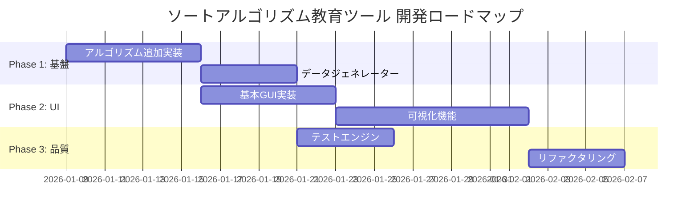

# Requirements Definition / 要件定義

このドキュメントでは、要求定義に基づいてソートアルゴリズム教育ツールの要件定義を詳細に記述します。

## 目次

- [1. システム概要](#1-システム概要)
- [2. 機能要件](#2-機能要件)
  - [2.1 ソートアルゴリズム](#21-ソートアルゴリズム)
  - [2.2 テストエンジン・データジェネレーター](#22-テストエンジンデータジェネレーター)
  - [2.3 GUI操作](#23-gui操作)
  - [2.4 可視化機能](#24-可視化機能)
  - [2.5 計算量分析](#25-計算量分析)
- [3. 非機能要件](#3-非機能要件)
- [4. 技術スタック](#4-技術スタック)
- [5. 現在の実装状況](#5-現在の実装状況)
- [6. 今後の開発計画](#6-今後の開発計画)

---

## 1. システム概要

### 1.1 目的

プログラミングやアルゴリズムの教育ツールとして、様々なソートアルゴリズムを提供し、学習者が視覚的にアルゴリズムの動作を理解できるソフトウェアを開発する。

### 1.2 対象ユーザー

- プログラミング初学者
- アルゴリズムを学ぶ学生
- ソートアルゴリズムの動作を視覚的に理解したい人

### 1.3 入出力仕様

| 項目 | 仕様 |
|------|------|
| **入力** | 1次元の整数配列 |
| **出力** | 昇順にソートされた整数配列 |

---

## 2. 機能要件

### 2.1 ソートアルゴリズム

複数のソートアルゴリズムを実装し、ユーザーが選択可能にする。

| ID | アルゴリズム | 実装状況 | 時間計算量 | 空間計算量 |
|----|--------------|----------|------------|------------|
| ALG-001 | バブルソート (Bubble Sort) | ✅ 実装済 | O(n²) | O(1) |
| ALG-002 | 選択ソート (Selection Sort) | ⬜ 未実装 | O(n²) | O(1) |
| ALG-003 | 挿入ソート (Insertion Sort) | ⬜ 未実装 | O(n²) | O(1) |
| ALG-004 | シェルソート (Shell Sort) | ⬜ 未実装 | O(n log²n) | O(1) |
| ALG-005 | マージソート (Merge Sort) | ⬜ 未実装 | O(n log n) | O(n) |
| ALG-006 | クイックソート (Quick Sort) | ⬜ 未実装 | O(n log n) | O(log n) |
| ALG-007 | ヒープソート (Heap Sort) | ⬜ 未実装 | O(n log n) | O(1) |

#### 2.1.1 アルゴリズム共通インターフェース

```kotlin
interface SortAlgorithm {
    fun sort(input: List<Int>): SortResult
}
```

- すべてのアルゴリズムは `SortAlgorithm` インターフェースを実装
- 新しいアルゴリズム追加時の拡張性を確保

---

### 2.2 テストエンジン・データジェネレーター

ソフトウェアの妥当性を検証するためのテスト機能を提供する。

#### 2.2.1 データジェネレーター

| ID | 機能 | 説明 |
|----|------|------|
| GEN-001 | ランダム配列生成 | 指定サイズのランダムな整数配列を生成 |
| GEN-002 | 昇順配列生成 | 既にソート済みの配列（最良ケース） |
| GEN-003 | 降順配列生成 | 逆順ソートの配列（最悪ケース） |
| GEN-004 | 部分ソート配列 | 一部がソートされた配列 |
| GEN-005 | 重複あり配列 | 同じ値を含む配列 |
| GEN-006 | サイズ指定 | ユーザーが配列サイズを指定可能 |
| GEN-007 | 手動入力 | ユーザーが配列を直接入力 |

#### 2.2.2 テストエンジン

| ID | 機能 | 説明 |
|----|------|------|
| TEST-001 | 正確性検証 | ソート結果が正しく昇順になっているか検証 |
| TEST-002 | 境界値テスト | 空配列、1要素配列、大規模配列でのテスト |
| TEST-003 | 一貫性検証 | 元の配列と同じ要素が含まれているか確認 |
| TEST-004 | パフォーマンス計測 | 実行時間、比較回数、スワップ回数の計測 |

---

### 2.3 GUI操作

CUIのみでなく、GUIでも操作可能にする。

#### 2.3.1 GUI機能一覧

| ID | 機能 | 説明 |
|----|------|------|
| GUI-001 | アルゴリズム選択 | ドロップダウンまたはボタンで選択 |
| GUI-002 | 配列入力 | テキストフィールドまたはスライダーでサイズ指定 |
| GUI-003 | 実行ボタン | ソートを開始 |
| GUI-004 | リセットボタン | 初期状態に戻す |
| GUI-005 | 結果表示 | ソート後の配列を表示 |
| GUI-006 | 統計情報表示 | 比較回数、スワップ回数、実行時間を表示 |

---

### 2.4 可視化機能

GUIで要素の動きをアニメーション表示し、アルゴリズムのステップを視覚的に学習可能にする。

#### 2.4.1 可視化要件

| ID | 機能 | 説明 |
|----|------|------|
| VIS-001 | バー表示 | 配列の各要素を棒グラフで視覚化 |
| VIS-002 | ハイライト | 比較・交換中の要素を色で識別 |
| VIS-003 | ステップ実行 | 1ステップずつ手動で進める |
| VIS-004 | 自動再生 | アニメーションを自動再生 |
| VIS-005 | 速度調整 | アニメーション速度をスライダーで調整 |
| VIS-006 | 一時停止/再開 | 再生中の一時停止と再開 |
| VIS-007 | 操作説明 | 現在のステップで行われている操作の説明表示 |

#### 2.4.2 スナップショット機構（実装済）

```kotlin
data class SortSnapshot(
    val arrayState: List<Int>,      // その時点での配列状態
    val highlightingIndices: List<Int>, // ハイライトする要素のインデックス
    val description: String          // 操作の説明
)
```

---

### 2.5 計算量分析

各アルゴリズムの計算量を分析し、教育目的で表示する。

#### 2.5.1 計算量メトリクス（実装済）

| ID | 項目 | 説明 |
|----|------|------|
| COMP-001 | 比較回数 | 要素同士の比較が行われた回数 |
| COMP-002 | スワップ回数 | 要素の交換が行われた回数 |
| COMP-003 | 実行時間 | 実際の実行時間（ナノ秒） |
| COMP-004 | 時間計算量 | 理論的な時間計算量（例: O(n²)） |
| COMP-005 | 空間計算量 | 理論的な空間計算量（例: O(1)） |

---

## 3. 非機能要件

### 3.1 拡張性

| ID | 要件 | 説明 |
|----|------|------|
| NFR-001 | アルゴリズム追加容易性 | `SortAlgorithm` インターフェースを実装するだけで新規追加可能 |
| NFR-002 | モジュール分離 | Presentation / Domain / Data の3層分離 |
| NFR-003 | デザインパターン適用 | Strategy パターンでアルゴリズムを切り替え |

### 3.2 クロスプラットフォーム

| ID | 要件 | 説明 |
|----|------|------|
| NFR-004 | デスクトップ対応 | JVM (Windows, macOS, Linux) |
| NFR-005 | Web対応 | JavaScript / WebAssembly |

### 3.3 保守性

| ID | 要件 | 説明 |
|----|------|------|
| NFR-006 | コード品質 | ktlint, detekt による静的解析 |
| NFR-007 | テストカバレッジ | ユニットテストでアルゴリズムの正確性を保証 |
| NFR-008 | ドキュメント | 日本語でのドキュメント整備 |

---

## 4. 技術スタック

| カテゴリ | 技術 |
|----------|------|
| **言語** | Kotlin |
| **UI フレームワーク** | Compose Multiplatform |
| **ターゲット** | Desktop (JVM), Web (Wasm/JS) |
| **ビルドツール** | Gradle (Kotlin DSL) |
| **アーキテクチャ** | Layered Architecture (MVI + DDD) |
| **コード品質** | ktlint, detekt |
| **バージョン管理** | Git / GitHub |
| **CI/CD** | GitHub Actions |

---

## 5. 現在の実装状況

### 5.1 完了済み

| カテゴリ | 内容 |
|----------|------|
| **アーキテクチャ** | Presentation / Domain / Data の3層構造 |
| **ドメインモデル** | `SortAlgorithm`, `SortResult`, `SortSnapshot`, `ComplexityMetrics` |
| **アルゴリズム** | バブルソート実装完了（スナップショット付き） |
| **ユースケース** | `ExecuteSortUseCase` |
| **ドキュメント** | アーキテクチャ、CI/CD、開発ガイド等 |

### 5.2 進行中・未着手

| カテゴリ | 内容 | 優先度 |
|----------|------|--------|
| **アルゴリズム** | 追加アルゴリズム実装 | 高 |
| **GUI** | ソートUIの実装 | 高 |
| **データジェネレーター** | 配列生成機能 | 中 |
| **可視化** | アニメーション・ビジュアライザー | 中 |
| **テストエンジン** | 自動テスト機能 | 中 |

---

## 6. 今後の開発計画



---

## 変更履歴

| 日付 | バージョン | 変更内容 |
|------|------------|----------|
| 2026-01-08 | 1.0.0 | 初版作成 |
