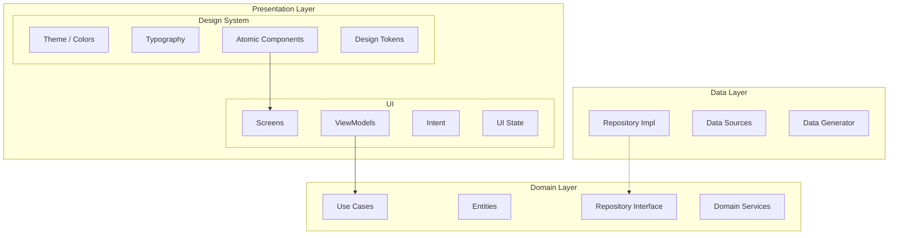
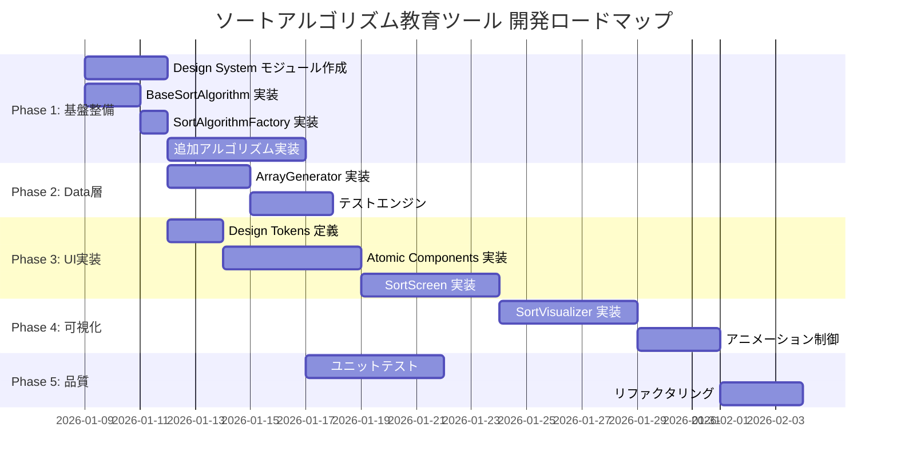

# Requirements Definition / 要件定義

このドキュメントでは、要求定義に基づいてソートアルゴリズム教育ツールの要件定義を詳細に記述します。

## 目次

- [1. システム概要](#1-システム概要)
- [2. アーキテクチャ設計](#2-アーキテクチャ設計)
- [3. 機能要件](#3-機能要件)
- [4. 実装詳細設計](#4-実装詳細設計)
- [5. 非機能要件](#5-非機能要件)
- [6. 技術スタック](#6-技術スタック)
- [7. 現在の実装状況](#7-現在の実装状況)
- [8. 今後の開発計画](#8-今後の開発計画)

---

## 1. システム概要

### 1.1 目的

プログラミングやアルゴリズムの教育ツールとして、様々なソートアルゴリズムを提供し、学習者が視覚的にアルゴリズムの動作を理解できるソフトウェアを開発する。

### 1.2 対象ユーザー

- プログラミング初学者
- アルゴリズムを学ぶ学生
- ソートアルゴリズムの動作を視覚的に理解したい人

### 1.3 入出力仕様

| 項目 | 仕様 |
|------|------|
| **入力** | 1次元の整数配列 |
| **出力** | 昇順にソートされた整数配列 |

---

## 2. アーキテクチャ設計

### 2.1 全体構成

```
dotnet/
├── composeApp/          # アプリケーションエントリポイント
├── presentation/        # Presentation Layer (MVI)
│   └── designsystem/    # Design System モジュール
├── domain/              # Domain Layer (DDD)
└── data/                # Data Layer
```

### 2.2 レイヤードアーキテクチャ



### 2.3 採用デザインパターン

| パターン | 適用箇所 | 目的 |
|----------|----------|------|
| **Strategy** | `SortAlgorithm` | アルゴリズムの動的切り替え |
| **Factory** | `SortAlgorithmFactory` | アルゴリズムインスタンス生成 |
| **Observer** | Kotlin Flow / StateFlow | リアクティブな状態管理 |
| **MVI** | ViewModel / Intent / State | 単方向データフロー |
| **Repository** | `DataGenerator` | データアクセスの抽象化 |
| **Command** | `SortIntent` | ユーザーアクションのカプセル化 |
| **Template Method** | `BaseSortAlgorithm` | アルゴリズムの共通処理 |

---

## 3. 機能要件

### 3.1 ソートアルゴリズム

| ID | アルゴリズム | 実装状況 | 時間計算量 | 空間計算量 |
|----|--------------|----------|------------|------------|
| ALG-001 | バブルソート (Bubble Sort) | ✅ 実装済 | O(n²) | O(1) |
| ALG-002 | 選択ソート (Selection Sort) | ⬜ 未実装 | O(n²) | O(1) |
| ALG-003 | 挿入ソート (Insertion Sort) | ⬜ 未実装 | O(n²) | O(1) |
| ALG-004 | シェルソート (Shell Sort) | ⬜ 未実装 | O(n log²n) | O(1) |
| ALG-005 | マージソート (Merge Sort) | ⬜ 未実装 | O(n log n) | O(n) |
| ALG-006 | クイックソート (Quick Sort) | ⬜ 未実装 | O(n log n) | O(log n) |
| ALG-007 | ヒープソート (Heap Sort) | ⬜ 未実装 | O(n log n) | O(1) |

### 3.2 テストエンジン・データジェネレーター

#### 3.2.1 データジェネレーター

| ID | 機能 | 説明 |
|----|------|------|
| GEN-001 | ランダム配列生成 | 指定サイズのランダムな整数配列を生成 |
| GEN-002 | 昇順配列生成 | 既にソート済みの配列（最良ケース） |
| GEN-003 | 降順配列生成 | 逆順ソートの配列（最悪ケース） |
| GEN-004 | 部分ソート配列 | 一部がソートされた配列 |
| GEN-005 | 重複あり配列 | 同じ値を含む配列 |
| GEN-006 | サイズ指定 | ユーザーが配列サイズを指定可能 |
| GEN-007 | 手動入力 | ユーザーが配列を直接入力 |

#### 3.2.2 テストエンジン

| ID | 機能 | 説明 |
|----|------|------|
| TEST-001 | 正確性検証 | ソート結果が正しく昇順になっているか検証 |
| TEST-002 | 境界値テスト | 空配列、1要素配列、大規模配列でのテスト |
| TEST-003 | 一貫性検証 | 元の配列と同じ要素が含まれているか確認 |
| TEST-004 | パフォーマンス計測 | 実行時間、比較回数、スワップ回数の計測 |

### 3.3 GUI操作

| ID | 機能 | 説明 |
|----|------|------|
| GUI-001 | アルゴリズム選択 | ドロップダウンまたはボタンで選択 |
| GUI-002 | 配列入力 | テキストフィールドまたはスライダーでサイズ指定 |
| GUI-003 | 実行ボタン | ソートを開始 |
| GUI-004 | リセットボタン | 初期状態に戻す |
| GUI-005 | 結果表示 | ソート後の配列を表示 |
| GUI-006 | 統計情報表示 | 比較回数、スワップ回数、実行時間を表示 |

### 3.4 CUI操作

ソフトウェアはGUIだけでなく、コマンドラインインターフェース（CUI）でも操作可能とする。JVM専用の別エントリポイントとして実装する。

#### 3.4.1 実行方法

```bash
# 基本的な使用
./gradlew runCli --args="--algorithm bubble --input 5,3,8,1,2"

# 対話式モード
./gradlew runCli
```

#### 3.4.2 CUI機能一覧

| ID | 機能 | 説明 |
|----|------|------|
| CUI-001 | アルゴリズム選択 | コマンドライン引数 `--algorithm` または対話式メニュー |
| CUI-002 | 配列入力 | 引数 `--input` でカンマ区切り指定 or 対話式入力 |
| CUI-003 | ランダム配列生成 | `--random <size>` でランダム配列を生成 |
| CUI-004 | ソート実行・結果表示 | ソート結果を標準出力に表示 |
| CUI-005 | 統計情報表示 | 比較回数、スワップ回数、実行時間を表示 |
| CUI-006 | ステップ表示 | `--verbose` で各ステップの詳細を表示 |
| CUI-007 | ヘルプ表示 | `--help` で使用方法を表示 |

#### 3.4.3 出力例

```
$ ./gradlew runCli --args="--algorithm bubble --input 5,3,8,1,2"

=== Sorting Visualizer (CLI) ===
Algorithm: Bubble Sort
Input:  [5, 3, 8, 1, 2]
Output: [1, 2, 3, 5, 8]

--- Statistics ---
Comparisons: 10
Swaps: 4
Time: 0.5ms
Time Complexity: O(n²)
Space Complexity: O(1)
```

### 3.5 可視化機能

| ID | 機能 | 説明 |
|----|------|------|
| VIS-001 | バー表示 | 配列の各要素を棒グラフで視覚化 |
| VIS-002 | ハイライト | 比較・交換中の要素を色で識別 |
| VIS-003 | ステップ実行 | 1ステップずつ手動で進める |
| VIS-004 | 自動再生 | アニメーションを自動再生 |
| VIS-005 | 速度調整 | アニメーション速度をスライダーで調整 |
| VIS-006 | 一時停止/再開 | 再生中の一時停止と再開 |
| VIS-007 | 操作説明 | 現在のステップで行われている操作の説明表示 |

### 3.6 計算量分析

| ID | 項目 | 説明 |
|----|------|------|
| COMP-001 | 比較回数 | 要素同士の比較が行われた回数 |
| COMP-002 | スワップ回数 | 要素の交換が行われた回数 |
| COMP-003 | 実行時間 | 実際の実行時間（ナノ秒） |
| COMP-004 | 時間計算量 | 理論的な時間計算量（例: O(n²)） |
| COMP-005 | 空間計算量 | 理論的な空間計算量（例: O(1)） |

---

## 4. 実装詳細設計

### 4.1 Domain Layer 設計

#### 4.1.1 モジュール構成

```
domain/src/commonMain/kotlin/dotnet/sort/
├── algorithm/
│   ├── SortAlgorithmFactory.kt     # Factory Pattern
│   ├── BaseSortAlgorithm.kt        # Template Method Pattern
│   ├── BubbleSortAlgorithm.kt
│   ├── SelectionSortAlgorithm.kt
│   ├── InsertionSortAlgorithm.kt
│   ├── ShellSortAlgorithm.kt
│   ├── MergeSortAlgorithm.kt
│   ├── QuickSortAlgorithm.kt
│   └── HeapSortAlgorithm.kt
├── model/
│   ├── SortAlgorithm.kt            # Strategy Interface
│   ├── SortResult.kt
│   ├── SortSnapshot.kt
│   ├── SortType.kt
│   └── ComplexityMetrics.kt
├── usecase/
│   ├── ExecuteSortUseCase.kt
│   ├── GenerateArrayUseCase.kt
│   └── ValidateSortResultUseCase.kt
├── generator/
│   ├── ArrayGenerator.kt           # Interface
│   └── ArrayGeneratorType.kt       # Enum
└── repository/
    └── ArrayGeneratorRepository.kt # Repository Interface
```

#### 4.1.2 Strategy Pattern - SortAlgorithm

```kotlin
// Strategy Interface
interface SortAlgorithm {
    val type: SortType
    fun sort(input: List<Int>): SortResult
}

// Template Method Pattern for common behavior
abstract class BaseSortAlgorithm : SortAlgorithm {
    protected val snapshots = mutableListOf<SortSnapshot>()
    protected var comparisonCount = 0L
    protected var swapCount = 0L

    override fun sort(input: List<Int>): SortResult {
        reset()
        val array = input.toMutableList()
        
        addSnapshot(array, emptyList(), "Start")
        
        val duration = measureTime {
            doSort(array)
        }
        
        addSnapshot(array, emptyList(), "Sorted")
        
        return SortResult(
            sortedArray = array,
            snapshots = snapshots.toList(),
            metrics = buildMetrics(duration)
        )
    }

    protected abstract fun doSort(array: MutableList<Int>)
    protected abstract val timeComplexity: String
    protected abstract val spaceComplexity: String

    protected fun compare(a: Int, b: Int): Int {
        comparisonCount++
        return a.compareTo(b)
    }

    protected fun swap(array: MutableList<Int>, i: Int, j: Int) {
        val temp = array[i]
        array[i] = array[j]
        array[j] = temp
        swapCount++
    }

    protected fun addSnapshot(array: List<Int>, highlights: List<Int>, description: String) {
        snapshots.add(SortSnapshot(array.toList(), highlights, description))
    }

    private fun reset() {
        snapshots.clear()
        comparisonCount = 0
        swapCount = 0
    }

    private fun buildMetrics(duration: Duration): ComplexityMetrics {
        return ComplexityMetrics(
            comparisonCount = comparisonCount,
            swapCount = swapCount,
            executionTimeNs = duration.inWholeNanoseconds,
            timeComplexity = timeComplexity,
            spaceComplexity = spaceComplexity
        )
    }
}
```

#### 4.1.3 Factory Pattern - SortAlgorithmFactory

```kotlin
object SortAlgorithmFactory {
    fun create(type: SortType): SortAlgorithm {
        return when (type) {
            SortType.BUBBLE -> BubbleSortAlgorithm()
            SortType.SELECTION -> SelectionSortAlgorithm()
            SortType.INSERTION -> InsertionSortAlgorithm()
            SortType.SHELL -> ShellSortAlgorithm()
            SortType.MERGE -> MergeSortAlgorithm()
            SortType.QUICK -> QuickSortAlgorithm()
            SortType.HEAP -> HeapSortAlgorithm()
        }
    }
}
```

#### 4.1.4 Array Generator

```kotlin
enum class ArrayGeneratorType {
    RANDOM,
    ASCENDING,
    DESCENDING,
    PARTIALLY_SORTED,
    DUPLICATES
}

interface ArrayGenerator {
    fun generate(size: Int, type: ArrayGeneratorType): List<Int>
    fun generate(size: Int, type: ArrayGeneratorType, range: IntRange): List<Int>
}
```

---

### 4.2 Presentation Layer 設計

#### 4.2.1 Design System モジュール構成

```
presentation/
├── src/commonMain/kotlin/dotnet/sort/
│   ├── ui/
│   │   ├── screens/
│   │   │   ├── SortScreen.kt
│   │   │   └── SettingsScreen.kt
│   │   ├── components/
│   │   │   ├── SortVisualizer.kt
│   │   │   ├── AlgorithmSelector.kt
│   │   │   ├── ArrayInputPanel.kt
│   │   │   ├── ControlPanel.kt
│   │   │   └── MetricsDisplay.kt
│   │   └── App.kt
│   ├── viewmodel/
│   │   ├── SortViewModel.kt
│   │   ├── SortIntent.kt
│   │   └── SortState.kt
│   └── navigation/
│       └── AppNavigation.kt
└── designsystem/
    └── src/commonMain/kotlin/dotnet/sort/designsystem/
        ├── theme/
        │   ├── Theme.kt
        │   ├── Color.kt
        │   ├── Typography.kt
        │   └── Shape.kt
        ├── tokens/
        │   ├── ColorTokens.kt
        │   ├── SpacingTokens.kt
        │   └── AnimationTokens.kt
        └── components/
            ├── atoms/
            │   ├── SortButton.kt
            │   ├── SortSlider.kt
            │   ├── SortChip.kt
            │   └── SortBar.kt
            ├── molecules/
            │   ├── ControlGroup.kt
            │   ├── MetricsCard.kt
            │   └── ArrayBar.kt
            └── organisms/
                ├── VisualizerPanel.kt
                └── ConfigurationPanel.kt
```

#### 4.2.2 Design Tokens

```kotlin
// ColorTokens.kt
object ColorTokens {
    // Semantic Colors
    val Primary = Color(0xFF6200EE)
    val Secondary = Color(0xFF03DAC6)
    val Background = Color(0xFFFAFAFA)
    val Surface = Color(0xFFFFFFFF)
    val Error = Color(0xFFB00020)

    // Visualization Colors
    val BarDefault = Color(0xFF42A5F5)
    val BarComparing = Color(0xFFFFCA28)
    val BarSwapping = Color(0xFFEF5350)
    val BarSorted = Color(0xFF66BB6A)
    val BarPivot = Color(0xFFAB47BC)
}

// SpacingTokens.kt
object SpacingTokens {
    val None = 0.dp
    val XXS = 2.dp
    val XS = 4.dp
    val S = 8.dp
    val M = 16.dp
    val L = 24.dp
    val XL = 32.dp
    val XXL = 48.dp
}

// AnimationTokens.kt
object AnimationTokens {
    val FastDuration = 150
    val NormalDuration = 300
    val SlowDuration = 500
    val VisualizationDelay = 50L // ms between steps
}
```

#### 4.2.3 Atomic Design Components

```kotlin
// Atoms - SortBar.kt
@Composable
fun SortBar(
    value: Int,
    maxValue: Int,
    state: BarState = BarState.Default,
    modifier: Modifier = Modifier
) {
    val color = when (state) {
        BarState.Default -> ColorTokens.BarDefault
        BarState.Comparing -> ColorTokens.BarComparing
        BarState.Swapping -> ColorTokens.BarSwapping
        BarState.Sorted -> ColorTokens.BarSorted
        BarState.Pivot -> ColorTokens.BarPivot
    }

    val heightFraction = value.toFloat() / maxValue.toFloat()

    Box(
        modifier = modifier
            .fillMaxHeight(heightFraction)
            .background(color, RoundedCornerShape(topStart = 4.dp, topEnd = 4.dp))
    )
}

enum class BarState {
    Default, Comparing, Swapping, Sorted, Pivot
}

// Molecules - ArrayBar.kt
@Composable
fun ArrayBar(
    array: List<Int>,
    highlightIndices: List<Int>,
    sortedIndices: Set<Int>,
    pivotIndex: Int? = null,
    modifier: Modifier = Modifier
) {
    val maxValue = array.maxOrNull() ?: 1
    
    Row(
        modifier = modifier.fillMaxWidth(),
        horizontalArrangement = Arrangement.SpaceEvenly,
        verticalAlignment = Alignment.Bottom
    ) {
        array.forEachIndexed { index, value ->
            val state = when {
                index in sortedIndices -> BarState.Sorted
                index == pivotIndex -> BarState.Pivot
                index in highlightIndices -> BarState.Comparing
                else -> BarState.Default
            }
            
            SortBar(
                value = value,
                maxValue = maxValue,
                state = state,
                modifier = Modifier
                    .weight(1f)
                    .padding(horizontal = SpacingTokens.XXS)
            )
        }
    }
}
```

#### 4.2.4 MVI Pattern - ViewModel

```kotlin
// SortIntent.kt
sealed class SortIntent {
    data class SelectAlgorithm(val type: SortType) : SortIntent()
    data class SetArraySize(val size: Int) : SortIntent()
    data class SetArray(val array: List<Int>) : SortIntent()
    data class GenerateArray(val generatorType: ArrayGeneratorType) : SortIntent()
    object StartSort : SortIntent()
    object PauseSort : SortIntent()
    object ResumeSort : SortIntent()
    object ResetSort : SortIntent()
    object StepForward : SortIntent()
    object StepBackward : SortIntent()
    data class SetSpeed(val speedMultiplier: Float) : SortIntent()
}

// SortState.kt
data class SortState(
    val selectedAlgorithm: SortType = SortType.BUBBLE,
    val array: List<Int> = emptyList(),
    val originalArray: List<Int> = emptyList(),
    val snapshots: List<SortSnapshot> = emptyList(),
    val currentSnapshotIndex: Int = 0,
    val highlightIndices: List<Int> = emptyList(),
    val sortedIndices: Set<Int> = emptySet(),
    val isPlaying: Boolean = false,
    val isSorting: Boolean = false,
    val isComplete: Boolean = false,
    val speedMultiplier: Float = 1.0f,
    val metrics: ComplexityMetrics? = null,
    val currentDescription: String = "",
    val error: String? = null
)

// SortViewModel.kt
class SortViewModel(
    private val executeSortUseCase: ExecuteSortUseCase,
    private val generateArrayUseCase: GenerateArrayUseCase
) : ViewModel() {

    private val _state = MutableStateFlow(SortState())
    val state: StateFlow<SortState> = _state.asStateFlow()

    private var playbackJob: Job? = null

    fun handleIntent(intent: SortIntent) {
        when (intent) {
            is SortIntent.SelectAlgorithm -> selectAlgorithm(intent.type)
            is SortIntent.SetArraySize -> setArraySize(intent.size)
            is SortIntent.SetArray -> setArray(intent.array)
            is SortIntent.GenerateArray -> generateArray(intent.generatorType)
            SortIntent.StartSort -> startSort()
            SortIntent.PauseSort -> pauseSort()
            SortIntent.ResumeSort -> resumeSort()
            SortIntent.ResetSort -> resetSort()
            SortIntent.StepForward -> stepForward()
            SortIntent.StepBackward -> stepBackward()
            is SortIntent.SetSpeed -> setSpeed(intent.speedMultiplier)
        }
    }

    private fun startSort() {
        viewModelScope.launch {
            val result = executeSortUseCase.execute(
                _state.value.selectedAlgorithm,
                _state.value.array
            )
            
            _state.update {
                it.copy(
                    snapshots = result.snapshots,
                    metrics = result.metrics,
                    currentSnapshotIndex = 0,
                    isSorting = true,
                    isPlaying = true
                )
            }
            
            startPlayback()
        }
    }

    private fun startPlayback() {
        playbackJob?.cancel()
        playbackJob = viewModelScope.launch {
            val snapshots = _state.value.snapshots
            var index = _state.value.currentSnapshotIndex

            while (index < snapshots.size && _state.value.isPlaying) {
                updateCurrentSnapshot(index)
                delay((AnimationTokens.VisualizationDelay / _state.value.speedMultiplier).toLong())
                index++
            }

            if (index >= snapshots.size) {
                _state.update { it.copy(isComplete = true, isPlaying = false, isSorting = false) }
            }
        }
    }

    private fun updateCurrentSnapshot(index: Int) {
        val snapshot = _state.value.snapshots.getOrNull(index) ?: return
        _state.update {
            it.copy(
                array = snapshot.arrayState,
                highlightIndices = snapshot.highlightingIndices,
                currentSnapshotIndex = index,
                currentDescription = snapshot.description
            )
        }
    }
    
    // ... other private methods
}
```

---

### 4.3 Data Layer 設計

#### 4.3.1 モジュール構成

```
data/src/commonMain/kotlin/dotnet/sort/
├── generator/
│   └── ArrayGeneratorImpl.kt
├── repository/
│   └── ArrayGeneratorRepositoryImpl.kt
└── di/
    └── DataModule.kt
```

#### 4.3.2 ArrayGenerator 実装

```kotlin
class ArrayGeneratorImpl : ArrayGenerator {
    
    private val random = Random

    override fun generate(size: Int, type: ArrayGeneratorType): List<Int> {
        return generate(size, type, 1..100)
    }

    override fun generate(size: Int, type: ArrayGeneratorType, range: IntRange): List<Int> {
        return when (type) {
            ArrayGeneratorType.RANDOM -> generateRandom(size, range)
            ArrayGeneratorType.ASCENDING -> generateAscending(size, range)
            ArrayGeneratorType.DESCENDING -> generateDescending(size, range)
            ArrayGeneratorType.PARTIALLY_SORTED -> generatePartiallySorted(size, range)
            ArrayGeneratorType.DUPLICATES -> generateWithDuplicates(size, range)
        }
    }

    private fun generateRandom(size: Int, range: IntRange): List<Int> {
        return List(size) { random.nextInt(range.first, range.last + 1) }
    }

    private fun generateAscending(size: Int, range: IntRange): List<Int> {
        return generateRandom(size, range).sorted()
    }

    private fun generateDescending(size: Int, range: IntRange): List<Int> {
        return generateRandom(size, range).sortedDescending()
    }

    private fun generatePartiallySorted(size: Int, range: IntRange): List<Int> {
        val sorted = generateAscending(size, range).toMutableList()
        val swapCount = size / 10
        repeat(swapCount) {
            val i = random.nextInt(size)
            val j = random.nextInt(size)
            val temp = sorted[i]
            sorted[i] = sorted[j]
            sorted[j] = temp
        }
        return sorted
    }

    private fun generateWithDuplicates(size: Int, range: IntRange): List<Int> {
        val uniqueValues = (size / 3).coerceAtLeast(3)
        val values = List(uniqueValues) { random.nextInt(range.first, range.last + 1) }
        return List(size) { values.random(random) }
    }
}
```

---

## 5. 非機能要件

### 5.1 拡張性

| ID | 要件 | 実装方法 |
|----|------|----------|
| NFR-001 | アルゴリズム追加容易性 | `BaseSortAlgorithm` を継承し `doSort()` を実装するだけ |
| NFR-002 | モジュール分離 | Presentation / Domain / Data / Design System の4層分離 |
| NFR-003 | デザインパターン適用 | Strategy, Factory, Template Method, MVI パターン |

### 5.2 クロスプラットフォーム

| ID | 要件 | 説明 |
|----|------|------|
| NFR-004 | デスクトップ対応 | JVM (Windows, macOS, Linux) |
| NFR-005 | Web対応 | JavaScript / WebAssembly |

### 5.3 保守性

| ID | 要件 | 説明 |
|----|------|------|
| NFR-006 | コード品質 | ktlint, detekt による静的解析 |
| NFR-007 | テストカバレッジ | ユニットテストでアルゴリズムの正確性を保証 |
| NFR-008 | ドキュメント | 日本語でのドキュメント整備 |

### 5.4 UI/UX

| ID | 要件 | 説明 |
|----|------|------|
| NFR-009 | Design System | Atomic Design に基づくコンポーネント設計 |
| NFR-010 | アニメーション | スムーズな可視化アニメーション |
| NFR-011 | レスポンシブ | デスクトップ・Webで適切なレイアウト |

---

## 6. 技術スタック

| カテゴリ | 技術 |
|----------|------|
| **言語** | Kotlin |
| **UI フレームワーク** | Compose Multiplatform |
| **ターゲット** | Desktop (JVM), Web (Wasm/JS) |
| **ビルドツール** | Gradle (Kotlin DSL) |
| **アーキテクチャ** | Layered Architecture (MVI + DDD) |
| **Design System** | Atomic Design (Atoms / Molecules / Organisms) |
| **コード品質** | ktlint, detekt |
| **バージョン管理** | Git / GitHub |
| **CI/CD** | GitHub Actions |

---

## 7. 現在の実装状況

### 7.1 完了済み

| カテゴリ | 内容 |
|----------|------|
| **アーキテクチャ** | Presentation / Domain / Data の3層構造 |
| **ドメインモデル** | `SortAlgorithm`, `SortResult`, `SortSnapshot`, `ComplexityMetrics` |
| **アルゴリズム** | バブルソート実装完了（スナップショット付き） |
| **ユースケース** | `ExecuteSortUseCase` |
| **ドキュメント** | アーキテクチャ、CI/CD、開発ガイド等 |

### 7.2 進行中・未着手

| カテゴリ | 内容 | 優先度 |
|----------|------|--------|
| **Design System** | designsystem モジュール作成 | 高 |
| **アルゴリズム** | 追加アルゴリズム実装 | 高 |
| **Factory/Base** | `SortAlgorithmFactory`, `BaseSortAlgorithm` | 高 |
| **GUI** | ソートUIの実装 | 高 |
| **データジェネレーター** | `ArrayGenerator` 実装 | 中 |
| **可視化** | アニメーション・ビジュアライザー | 中 |
| **テストエンジン** | 自動テスト機能 | 中 |

---

## 8. 今後の開発計画



---

## 変更履歴

| 日付 | バージョン | 変更内容 |
|------|------------|----------|
| 2026-01-08 | 1.0.0 | 初版作成 |
| 2026-01-08 | 2.0.0 | 実装詳細設計、Design System、デザインパターン追加 |
