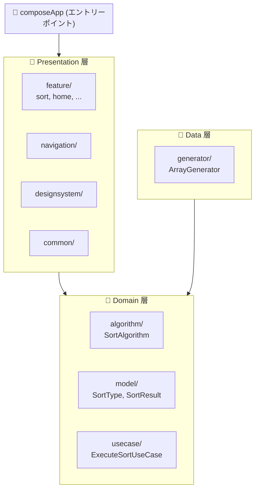

# オンボーディング

このドキュメントは、プロジェクトに参加した開発者が最初に読むべきアーキテクチャ概要です。

---

## プロジェクト概要

**DNSort** は、ソートアルゴリズムの可視化・学習ツールです。

| 項目 | 内容 |
|------|------|
| **プラットフォーム** | Desktop (JVM), Web (JS), Android |
| **言語** | Kotlin Multiplatform |
| **UI** | Jetpack Compose Multiplatform |
| **DI** | Koin |
| **アーキテクチャ** | Clean Architecture + MVI |

---

## アーキテクチャ

### レイヤー構成



### 依存関係ルール

```
Presentation → Domain ← Data
```

- **Domain 層は他の層に依存しない** (純粋なビジネスロジック)
- Data 層は Domain 層のインターフェースを実装
- Presentation 層は Domain 層を使用

---

## MVI パターン

Presentation 層では **MVI (Model-View-Intent)** を採用しています。

```
User Input → Intent → ViewModel → State → UI
```

| コンポーネント | 役割 |
|----------------|------|
| **State** | UI の状態を表す不変データ |
| **Intent** | ユーザーの意図 (アクション) |
| **ViewModel** | Intent を受け取り State を更新 |
| **Screen** | State を表示し Intent を発火 |

> 詳細は [STATE_MANAGEMENT.md](./reference/STATE_MANAGEMENT.md) を参照してください。

---

## デザインパターン

### Domain 層

| パターン | 用途 | 例 |
|----------|------|-----|
| **Strategy** | アルゴリズム切り替え | `SortAlgorithm` インターフェース |
| **Factory** | インスタンス生成 | `SortAlgorithmFactory` |
| **Template Method** | 共通処理フレームワーク | `BaseSortAlgorithm` |

### Presentation 層

| パターン | 用途 | 例 |
|----------|------|-----|
| **MVI** | 単方向データフロー | `ViewModel`, `State`, `Intent` |
| **Atomic Design** | コンポーネント設計 | Atoms, Molecules |

---

## プロジェクト構造

```
dotnet/
├── composeApp/           # アプリエントリーポイント
├── domain/               # Domain 層
│   └── src/commonMain/
│       └── kotlin/dotnet/sort/
│           ├── algorithm/    # SortAlgorithm 実装
│           ├── model/        # SortType, SortResult 等
│           └── usecase/      # UseCase
├── data/                 # Data 層
│   └── src/commonMain/
│       └── kotlin/dotnet/sort/
│           └── generator/    # ArrayGenerator
├── presentation/         # Presentation 層
│   ├── navigation/       # NavHost, Screen routes
│   ├── designsystem/     # Design tokens, components
│   ├── common/           # 共通ユーティリティ
│   └── feature/          # 機能別モジュール
│       ├── home/
│       ├── sort/
│       ├── learn/
│       ├── compare/
│       └── settings/
└── cli/                  # CLI アプリ
```

---

## 次に読むべきドキュメント

| 順序 | ドキュメント | 内容 |
|------|--------------|------|
| 1 | [FUNDAMENTALS.md](./FUNDAMENTALS.md) | 基礎ルール (命名, データモデル, KDoc) |
| 2 | [tasks/*.md](./tasks/) | 実装タスク時に参照 |

---

## 参考リンク

| トピック | リンク |
|----------|--------|
| **Android App Architecture** | [developer.android.com](https://developer.android.com/topic/architecture) |
| **Compose Multiplatform** | [jetbrains.com](https://www.jetbrains.com/lp/compose-multiplatform/) |
| **Koin** | [insert-koin.io](https://insert-koin.io/) |
