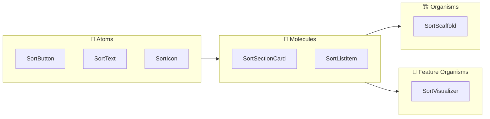

# Design System コンポーネント粒度

このドキュメントでは、Design System におけるコンポーネントの粒度（Atoms, Molecules, Organisms）の定義と分類基準について説明します。

---

## 目的

プロジェクト全体でコンポーネントの分類基準を統一し、再利用性と保守性を高めることを目的としています。

---

## 対象読者

- **UI実装者**: 新しいコンポーネントを作成する際、どのディレクトリに配置すべきか判断するため。
- **レビュアー**: コンポーネントの粒度が適切か判断するため。

---

## 🏗 コンポーネント粒度 (Atomic Design)

`presentation/designsystem` モジュールでは、以下の3つのレベルにコンポーネントを分類します。

| レベル | 定義 | 特徴 | 例 |
|-------|------------|-----------------|----------|
| **Atoms** | **最小の構成要素**<br>これ以上分解すると機能的な意味を失う要素。 | 🧩 **ステートレス** (原則)<br>🎨 **トークンを直接使用** (Color, Typography)<br>⛔ **ビジネスロジックなし** | `SortButton`, `SortText`, `SortIcon`, `SortSlider` |
| **Molecules** | **Atoms の組み合わせ**<br>単純な機能単位を形成するグループ。 | 🔗 **Atoms の結合**<br>🛠 **UIロジックのみ**<br>♻️ **高い再利用性** | `SearchField` (Input + Icon), `SortSectionCard`, `SortListItem` |
| **Organisms** | **画面の主要セクション**<br>複数の Molecules や Atoms から構成される大きな区画。 | 🏗 **レイアウト構造**<br>🧠 **コンテキストを持つ**<br>📱 **画面の特定セクション** | `SortScaffold`, `GlobalHeader` |



---

## 📏 配置ガイドライン（厳密な基準）

関心の分離（Separation of Concerns）に基づき、以下の基準で配置場所を決定します。特に **Organisms** は注意が必要です。

### 1. Design System に置くべきもの (共通 Organisms)

以下の **すべて** を満たす場合のみ `presentation/designsystem` に配置します。

- ✅ **ドメインロジックを持たない**: 特定のビジネスロジックや ViewModel に依存しない。
- ✅ **複数の機能で再利用される**: 特定の機能（Feature）専用ではない。
- ✅ **UIの構造定義**: レイアウトやスカフォールドなど、ガワを提供するもの。

**例**: `SortScaffold` (全画面共通の枠組み), `LoadingOverlay` (共通のローディング表示)

### 2. Feature モジュールに置くべきもの (機能別 Organisms)

以下の **いずれか** に当てはまる場合は、各 Feature モジュールの `components` ディレクトリに配置します。

- 🚩 **特定のドメイン知識が必要**: 特定のデータ型（`User`, `Product`など）を直接扱う。
- 🚩 **特定の機能でのみ使用**: 他の画面では使われない。
- 🚩 **ビジネスロジックを含む**: 複雑な状態遷移や API コールを含む。

**例**: `SortVisualizer` (ソート機能特有), `ProfileHeader` (プロファイル画面特有)

---

## 🏗 分類判定フローチャート

1. **基本要素ですか？** (Button, Text) → **Atom** (`designsystem`)
2. **単純な組み合わせですか？** (ListTile, InputField) → **Molecule** (`designsystem`)
3. **複雑なセクションですか？** → **Organism**
    - **特定の機能専用ですか？**
        - YES → **Feature Components** (`feature/{name}/components/`)
        - NO (汎用的) → **Design System Organisms** (`designsystem/components/organisms/`)

---

## 📁 ディレクトリ構造

```
presentation/designsystem/src/commonMain/kotlin/dotnet/sort/designsystem/
├── components/
│   ├── atoms/       # 🧱 基本要素
│   ├── molecules/   # 🔗 複合要素
│   └── organisms/   # 🏗 汎用的な複合セクション (SortScaffoldのみなど)
├── theme/           # 🎨 テーマ
└── tokens/          # 📐 デザイントークン
```

---

## 関連ドキュメント

| ドキュメント | 説明 |
|--------------|------|
| [Common コンポーネント](../common/README.md) | ドメイン依存・共通コンポーネントの定義 |
| [デザインシステム概要](../../../doc/DESIGN_SYSTEM.md) | トークンやテーマの詳細定義 |
| [UIコンポーネント追加ガイド](../../../doc/guide/tasks/ADD_UI_COMPONENT.md) | コンポーネントの実装手順 |

